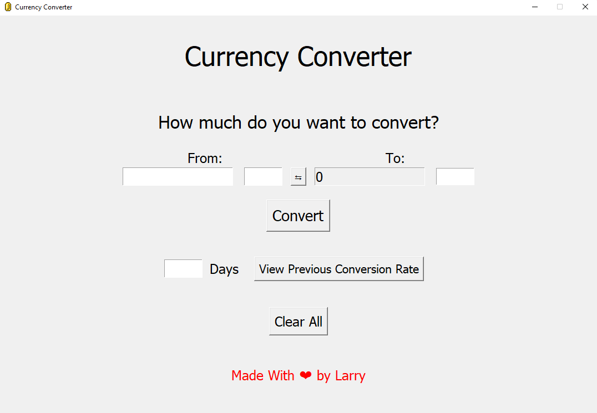
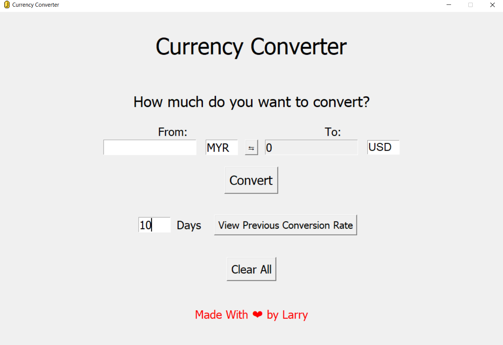
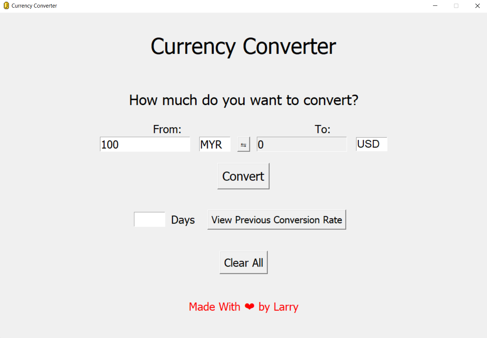

# Currency Converter 💵

## I. Introduction

This simple currency converter application retrieves data from **ExchangeRate-API** to help you to calculate foreign exchange rates based on present-day exchange rates and quickly convert the value of one currency to another with ease. (Disclaimer: the figures retrieved from the API may not be exactly according to real-time exchange rates.)

## II. Getting Started

You can use the currency converter by simply downloading the executable file.

## III. Documentation

To view all the currencies supported by ExchangeRate-API, please click on this [link](https://www.exchangerate-api.com/docs/supported-currencies) and head to "All Supported Currencies" and "Notes For Some Supported Currencies" section. You can only retrieve data about previous conversion rates as far as a year ago. This is done to limit the requests sent to the API.

This is what you should see on your screen when you have successfully run the executable file. The application may take some time to load before showing the interface.

The interface contains four entry fields that the user can enter values or letters into and four buttons that can be pressed. The arrow button swaps the two currencies that you are currently comparing and the "Clear All" button deletes all the existing characters from the fields. 

Here are two screenshots to show which fields to enter for the application to work properly.

If you are viewing data about previous conversion rates from a small screen display, you can use the tools placed at the bottom-left of the graph interface to help view the data more clearly.

## IV. Technologies Used

The notable technologies used in this application are **Python** and **Tkinter**. Tkinter is used to build the Graphical User Interface (GUI) for the application. Additionally, **Matplotlib** is used as well to display the data about previous conversion rates.

## V. Others
The source code for the application will be included in this repository, feel free to explore it. Any feedback is very much appreciated. The aim of developing this simple currency converter application is for me to spend more time coding with Python and improve my programming skills in general.
